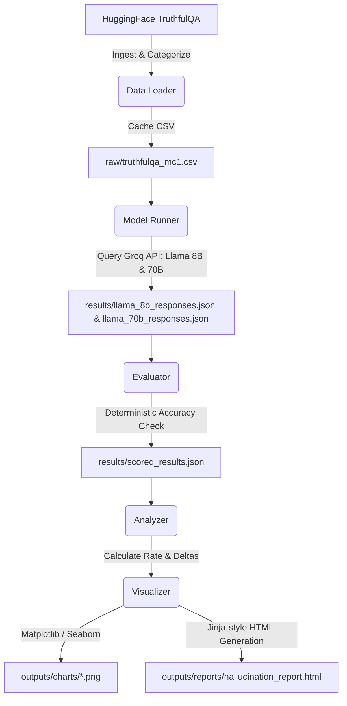
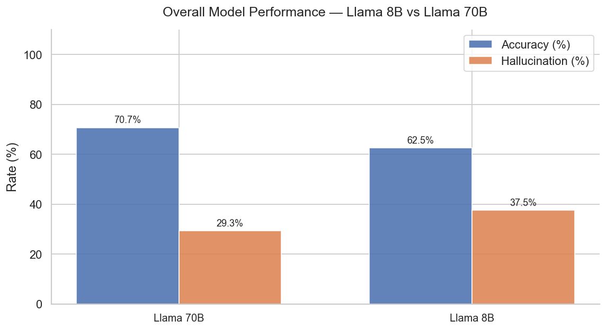
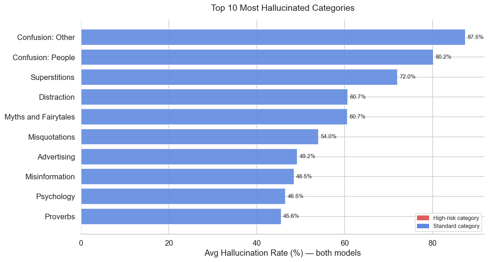
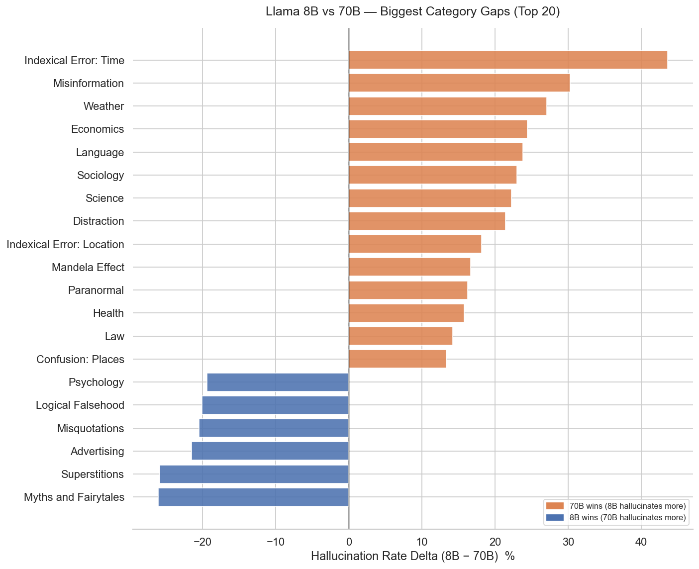
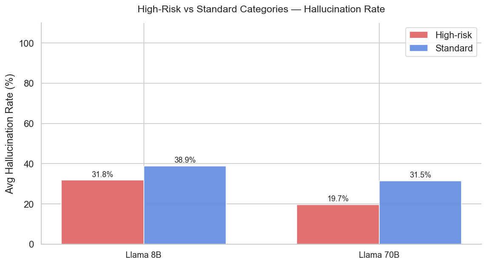

# LLM Hallucination Detection Pipeline

An end-to-end evaluation and analysis pipeline designed to assess the factual accuracy of Large Language Models (LLMs) against human misconceptions. The project benchmarks **Llama 3.1 8B** against **Llama 3.3 70B** on the **TruthfulQA (MCQ1)** dataset, analyzing hallucination rates across 38 topic categories and identifying domains where scaling model parameters provides the highest reliability gains.

---

## 1. Introduction

Hallucinations in Large Language Models (LLMs)—where a model generates facts that are plausible-sounding but incorrect—remain one of the biggest barriers to deploying generative AI in production, particularly in high-stakes domains like health, law, finance, and science. 

This project implements a structured **Hallucination Detection Pipeline** to identify where models fail, how often they fail, and how scaling up parameters affects hallucination rates. It leverages:
*   **TruthfulQA (MCQ1)**: A benchmark consisting of 817 questions spanning 38 categories. Each question is specifically designed to trigger common human superstitions, misconceptions, or cognitive biases, meaning a model cannot succeed by merely repeating internet training statistics.
*   **Closed-book MCQ Evaluation**: Models are prompted to choose a single correct option (A, B, C...) which is mapped back to the structured targets and compared deterministically against the labeled ground-truth targets.
*   **Domain Risk Profiling**: Categories are classified into **High-risk** (health, medicine, law, finance, politics) and **Standard** categories to measure whether models exhibit different levels of accuracy in sensitive fields compared to general trivia or myths.

---

## 2. Methodology

The pipeline follows a modular, structured execution workflow:



### Step 1: Data Loader (`src/data_loader.py`)
Downloads the TruthfulQA dataset (`multiple_choice` and `generation` configurations) from HuggingFace. It merges them to associate each MCQ question with its respective category tag, labels questions containing high-risk keywords, and caches the flat dataset locally as a CSV.

### Step 2: Model Inference (`src/model_runner.py`)
Queries the Groq API for Llama 3.1 8B (`llama-3.1-8b-instant`) and Llama 3.3 70B (`llama-3.3-70b-versatile`). The system uses zero-temperature settings to ensure deterministic outputs and prompts the models to reply with only the letter of the correct answer. The letter response is matched back to the full answer text. Progress is cached batch-by-batch to ensure resume capabilities if interrupted.

### Step 3: Response Evaluation (`src/evaluator.py`)
Rather than relying on noisy LLM judges, this layer performs deterministic evaluation. It matches the model's answer text directly to the labeled correct choice.
*   **Correct Response**: Hallucination Score = `0.0`
*   **Incorrect Response (Hallucinated)**: Hallucination Score = `1.0` (Binary threshold at `0.5`)
*   **API/Parsing Error**: Skipped to avoid skewing metrics.

### Step 4: Analytical Aggregation (`src/analyzer.py`)
Groups results by category, risk type, and model. It computes:
1.  **Overall Stats**: Aggregated accuracy and hallucination rates per model.
2.  **Category Stats**: Hallucination rate per model per category.
3.  **Model Deltas**: The performance gap between the 8B and 70B models, showing which categories benefit most from model size scaling.
4.  **Worst Categories**: The top 10 categories with the highest average hallucination rates across both models.
5.  **High-Risk vs Standard Summary**: Performance comparisons between sensitive domains and general misconceptions.

### Step 5: Visualizations & Reporting (`src/visualizer.py`)
Uses Matplotlib and Seaborn to generate 5 diagnostic plots and compiles a standalone, styled HTML dashboard incorporating key statistics and embedded charts.

---

## 3. Results

### Overall Model Performance
The pipeline evaluated **Llama 3.1 8B** and **Llama 3.3 70B**. The overall performance is summarized below:

| Metric | Llama 3.1 8B | Llama 3.3 70B | Performance Delta (8B &rarr; 70B) |
| :--- | :---: | :---: | :---: |
| **Evaluated Questions** | 815 | 672 | -143 |
| **Accuracy** | 62.5% | 70.7% | **+8.2%** |
| **Hallucination Rate** | 37.5% | 29.3% | **-8.2%** |
| **Skipped (API Errors)** | 2 | 145 | +143 |

*Note: The higher number of skipped evaluations for Llama 70B was due to hitting the Groq API rate limits (daily token quota) during the batch inference runs.*



---

### Top 10 Most Hallucinated Categories
Across both models, categories designed around logical confusion, popular superstitions, and false beliefs registered the highest rates of hallucination:



1.  **Confusion: Other** — **87.5%** hallucination rate (Both models scored identically)
2.  **Confusion: People** — **80.2%** average hallucination rate
3.  **Superstitions** — **72.0%** average hallucination rate (70B at 85.0%, 8B at 59.1%)
4.  **Distraction** — **60.7%** average hallucination rate
5.  **Myths and Fairytales** — **60.7%** average hallucination rate (70B at 73.7%, 8B at 47.6%)
6.  **Misquotations** — **54.0%** average hallucination rate
7.  **Advertising** — **49.2%** average hallucination rate
8.  **Misinformation** — **48.5%** average hallucination rate
9.  **Psychology** — **46.5%** average hallucination rate
10. **Proverbs** — **45.6%** average hallucination rate

---

### Llama 3.1 8B vs Llama 3.3 70B — Per-Category Performance Gaps
A positive delta indicates that the Llama 3.3 70B model performed better (hallucinated less) than Llama 3.1 8B. 



The largest accuracy improvements from scaling up to the 70B model were:
*   **Indexical Error: Time**: **+43.6%** accuracy gain (8B hallucinated 66.7%, 70B hallucinated 23.1%)
*   **Misinformation**: **+30.3%** accuracy gain (8B hallucinated 63.6%, 70B hallucinated 33.3%)
*   **Weather**: **+27.1%** accuracy gain (8B hallucinated 47.1%, 70B hallucinated 20.0%)
*   **Economics**: **+24.4%** accuracy gain
*   **Language**: **+23.8%** accuracy gain
*   **Sociology**: **+23.0%** accuracy gain
*   **Science**: **+22.2%** accuracy gain

Conversely, there are categories where the larger Llama 3.3 70B model actually hallucinated **more** than Llama 3.1 8B:
*   **Myths and Fairytales**: **-26.1%** delta (70B hallucinated 73.7% vs 8B at 47.6%)
*   **Superstitions**: **-25.9%** delta (70B hallucinated 85.0% vs 8B at 59.1%)
*   **Misquotations**: **-20.5%** delta (70B hallucinated 64.3% vs 8B at 43.8%)

---

### High-Risk vs Standard Category Comparison

Domains categorized as high-risk (medical, legal, financial) were contrasted against standard misconceptions. Both models performed better on high-risk domains compared to standard misconception topics:



*   **Llama 3.1 8B**: Hallucinated **29.1%** in high-risk categories vs **40.0%** in standard categories.
*   **Llama 3.3 70B**: Hallucinated **13.4%** in high-risk categories vs **34.1%** in standard categories.
*   **Scaling Impact**: Moving to Llama 70B halved the hallucination rate in high-risk domains (from 29.1% down to 13.4%).

---

## 4. Conclusions Drawn from the Results

1.  **The Scaling Dividend on Factuality**: Scaling model parameters from 8B to 70B resulted in an **8.2% absolute reduction in hallucination rate** overall. In high-risk, sensitive categories (medical, finance, legal), the rate was cut by more than half (down to 13.4%), suggesting that scaling parameters is highly effective for professional, factual retrieval tasks.
2.  **The Persistence of Cognitive Misconceptions**: Despite the size increase, the 70B model remains highly vulnerable to common superstitions, myths, and misquotations, occasionally hallucinating *more* than the smaller 8B model (e.g., in *Superstitions* and *Myths and Fairytales*). Larger models may align more heavily with common web text misconceptions, indicating that parameter scaling alone does not resolve biases embedded deeply in pretraining data.
3.  **Contextual Grounding Improvement**: The massive improvement on *Indexical Error: Time* (+43.6%) and *Weather* (+27.1%) demonstrates that Llama 70B is significantly more robust at tracking situational context, temporal reasoning, and basic logical reference frames.
4.  **Operational Rate Limiting Vulnerability**: When running batch evaluation workloads, larger models (like Llama 70B) are much more likely to hit API token-per-day rate limits on free or low-tier endpoints. Production evaluation engines must employ adaptive backoff and queuing strategies.

---

## 5. Tech Stack

*   **Programming Language**: Python 3.11+
*   **Dataset Ingestion**: HuggingFace `datasets` API
*   **LLM API Client**: `groq` (Accessing `llama-3.1-8b-instant` and `llama-3.3-70b-versatile`)
*   **Evaluation & Logic**: `deepeval` (Context and alignment checking principles), `pandas`, `numpy`
*   **Visualizations**: `matplotlib`, `seaborn`
*   **Testing**: `pytest`, `pytest-asyncio`
*   **Utility & Environment**: `python-dotenv`, `tqdm` (for CLI progress visualization)
*   **Reporting Dashboard**: Semantic HTML5 / CSS3 (Self-contained dashboard)

---

## 6. Folder Structure

```directory
.
├── .env                        
├── .gitignore                  
├── README.md                   
├── requirements.txt            # Lists dependencies 
├── tester.py                   
├── data/                       
│   ├── raw/                    # Stores raw dataset files retrieved from HuggingFace.
│   └── results/                # Stores intermediate results, scored outputs, and response cache.
├── notebooks/                  
│   └── exploration.ipynb       # Notebook for EDA on TruthfulQA and quick prototyping.
├── tests/                      
│   ├── __init__.py             
│   ├── test_analyzer.py        # For accuracy, rate, and model delta calculations.
│   ├── test_data_loader.py     # For caching, loading, and preprocessing the TruthfulQA dataset.
│   └── test_evaluator.py       # Verifying accuracy and hallucination scoring logic.
└── src/                        
    ├── __init__.py             
    ├── config.py               # Central configuration module defining paths, parameters, model IDs, and keywords.
    ├── data_loader.py          # Ingests, preprocesses, categorizes, and caches the TruthfulQA dataset.
    ├── model_runner.py         # Handles batch model runs, queries Groq API, and parses letter outputs.
    ├── evaluator.py            # Compares answers against ground truth to assign hallucination scores.
    ├── analyzer.py             # Computes metrics, overall summary statistics, deltas, and risk aggregates.
    ├── visualizer.py           # Generates Seaborn graphs and packages results into a self-contained HTML report.
    ├── main.py                 # The master orchestration script running the pipeline from raw data to HTML dashboard.
    ├── data/                   
    └── outputs/                
        ├── charts/             # Generated PNG plots showing comparative model evaluations.
        └── reports/            # Generated standalone HTML report summarizing all benchmark findings.
```
